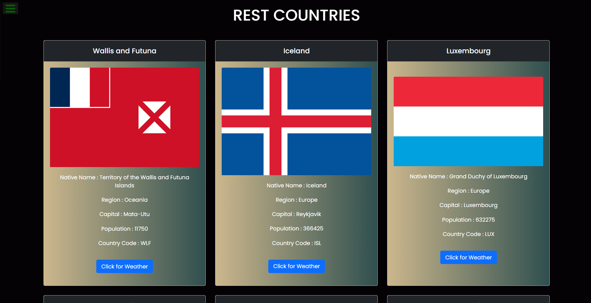

# RestCountries

A web application that provides information about countries, including their capitals, regions, populations, and more. Click on a country to see the weather in its capital city.

## Features

- **Country Information:** Displays details like native name, region, capital, population, and country code.
- **Weather Information:** Shows weather details for the capital city when clicked.
- **Responsive Design:** Adaptable to various screen sizes using Bootstrap.

## Technologies Used

- HTML
- CSS
- JavaScript
- Bootstrap
- OpenWeatherMap API
- RestCountries API

## Usage

- The main page lists countries with their details.
- Click on the "Click for Weather" button to open a modal with the weather information for the selected country's capital city.

---
## Conclusion

Explore detailed country information and real-time weather updates seamlessly with RestCountries. Designed to be responsive and user-friendly, this project integrates Bootstrap and APIs for a dynamic experience.

